<!-- ========================================================= -->
<!--                    MAHDA CAWL PROFILE                     -->
<!-- ========================================================= -->

<!-- 🌌 Animated Banner -->
<p align="center">
  
</p>

<br>

<!-- 👩‍💻 PROFILE INTRO -->
<div align="center">


<br><br>

</div>

---

<!-- ========================================================= -->
<!--                     WELCOME SECTION                        -->
<!-- ========================================================= -->

<div align="center">

# 👋 Welcome to My Profile


</div>

---

<!-- ========================================================= -->
<!--                       ABOUT ME                             -->
<!-- ========================================================= -->

# 💫 About Me

<table>
<tr>

<td width="55%" valign="top">

I'm **Mahda Cawl**, a passionate **Software Engineering student** interested in building modern, useful, and creative digital applications.

### 🚀 What I Do

- 💻 **Full-Stack Development**
- 🎨 **UI/UX Design**
- 📱 **Mobile App Development**
- 🤖 **AI Engineering & Integration**
- 🛡️ **Cybersecurity Exploration**
- 🌱 **Continuous Learning & Building**

I enjoy transforming ideas into **real-world digital products** and exploring new technologies.

### 🎯 My Goal

> To build innovative software that solves real problems and creates meaningful digital experiences.

### 💡 My Interests

- 🌐 Modern Web Applications
- 📱 Mobile Applications
- 🤖 Artificial Intelligence
- 🔐 Cybersecurity
- 🎨 User Experience
- ⚙️ Software Architecture
- 🚀 Automation

</td>

<td width="45%" align="center">


</td>

</tr>
</table>

---

<!-- ========================================================= -->
<!--                       TECH STACK                           -->
<!-- ========================================================= -->

# 🛠️ Tech Stack

<div align="center">

### 🎨 Frontend


<br><br>

### ⚙️ Backend


<br><br>

### 📱 Mobile Development


<br><br>

### 🤖 AI & Automation


<br><br>

### 🗄️ Databases


<br><br>

### 🔧 Tools & Platforms


</div>

---

<!-- ========================================================= -->
<!--                   CURRENTLY WORKING ON                     -->
<!-- ========================================================= -->

# 🚀 Currently Working On

<div align="center">

| 🚀 Area | 💡 Focus |
|:---:|:---|
| 💻 Web Development | Full-Stack Applications |
| 📱 Mobile Development | Flutter & Dart |
| 🤖 Artificial Intelligence | AI Integration & Automation |
| 🎨 UI/UX | Modern Interfaces |
| 🛡️ Cybersecurity | Secure Web Applications |
| ⚙️ Backend | Django, Python & APIs |

</div>

---

<!-- ========================================================= -->
<!--                    FEATURED PROJECTS                       -->
<!-- ========================================================= -->


**Tech:** `Python` • `Django` • `Web Security` • `Secure Coding`

---

<!-- ========================================================= -->
<!--                   DEVELOPMENT ROADMAP                      -->
<!-- ========================================================= -->

# 🗺️ My Development Roadmap

<div align="center">


</div>

---

<!-- ========================================================= -->
<!--                  LEARNING JOURNEY                         -->
<!-- ========================================================= -->

# 🌱 Learning Journey

```text
                         👩‍💻 SOFTWARE ENGINEERING
                                  │
             ┌────────────────────┼────────────────────┐
             │                    │                    │
             ▼                    ▼                    ▼
       💻 DEVELOPMENT        📱 MOBILE              🤖 AI
             │                    │                    │
        ┌────┴────┐          ┌────┴────┐         ┌────┴────┐
        │         │          │         │         │         │
        ▼         ▼          ▼         ▼         ▼         ▼
    Frontend   Backend     Flutter    Dart     AI Tools  Automation
        │         │
        ▼         ▼
      React     Django
      HTML      Python
      CSS       APIs

             ┌────────────────────┴────────────────────┐
             │                                         │
             ▼                                         ▼
        🎨 UI/UX DESIGN                         🛡️ CYBERSECURITY
             │                                         │
        ┌────┴────┐                              ┌─────┴─────┐
        ▼         ▼                              ▼           ▼
      Figma    Prototyping                  Web Security  Secure Coding
